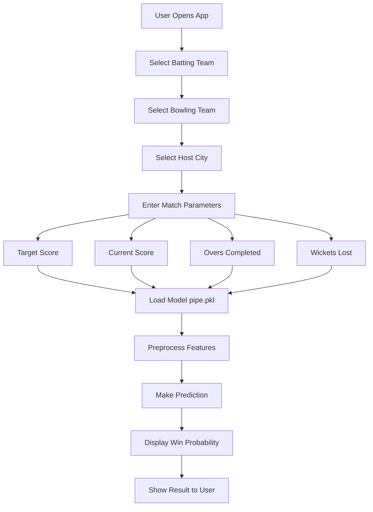
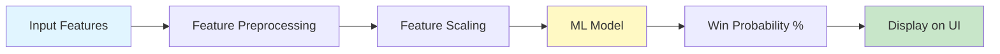

# IPL Win Predictor 🏏

A machine learning-based web application that predicts the winning probability of teams in IPL (Indian Premier League) matches.

**🌐 [See Live](https://ipl-prediction-model-7.onrender.com/)**

---

## 📋 Project Overview

This application uses a pre-trained machine learning model to predict the probability of a batting team winning based on match parameters like:
- Batting team
- Bowling team
- Host city
- Target score
- Current score
- Overs completed
- Wickets lost

---

## 📁 Project Structure

```
ipl_first/
├── app.py                 # Main Streamlit application
├── pipe.pkl               # Pre-trained ML model (pickle file)
├── requirements.txt       # Python dependencies
├── pyproject.toml         # Project configuration (for Render deployment)
├── render.yaml            # Render deployment settings
├── .gitignore             # Git ignore rules
└── README.md              # This file
```

---

## 📄 File Descriptions

### **app.py**
- **Purpose:** Main Streamlit web application
- **Functionality:**
  - Displays the user interface for the IPL predictor
  - Collects match parameters from user inputs (team selections, score, overs, wickets)
  - Loads the pre-trained ML model from `pipe.pkl`
  - Makes predictions and displays results
  - Error handling for missing model files

### **pipe.pkl**
- **Purpose:** Pre-trained machine learning model
- **Contains:**
  - Trained pipeline with feature preprocessing
  - Model coefficients for win probability prediction
  - All necessary transformations and encodings
- **Size:** Binary pickle format for fast loading

### **requirements.txt**
- **Purpose:** Lists all Python package dependencies
- **Packages:**
  - `streamlit` - Web framework for the UI
  - `pandas` - Data manipulation and analysis
  - `numpy` - Numerical computing
  - `scikit-learn==1.6.1` - Machine learning library

### **pyproject.toml**
- **Purpose:** Project metadata and build configuration
- **Used by:** Package managers and deployment platforms
- **Contains:** Project dependencies, Python version, build specifications

### **render.yaml**
- **Purpose:** Deployment configuration for Render platform
- **Specifies:**
  - Runtime environment (Python 3.11)
  - Build commands
  - Start command for Streamlit
  - Environment variables

### **.gitignore**
- **Purpose:** Specifies which files Git should ignore
- **Excludes:** Python cache, virtual environments, IDE files, OS files

---

## 🔄 Application Flow



---

## 🏗️ Model Architecture Flow



---

## 🚀 Quick Start

### Prerequisites
- Python 3.9+
- pip (Python package manager)

### Installation

1. **Clone the repository:**
   ```bash
   git clone https://github.com/toru837/IPL_PREDICTION_MODEL_7.git
   cd ipl_first
   ```

2. **Install dependencies:**
   ```bash
   pip install -r requirements.txt
   ```

3. **Run the application:**
   ```bash
   streamlit run app.py
   ```

4. **Access the app:**
   - Local: Open browser to `http://localhost:8501`
   - Live: Visit [https://ipl-prediction-model-7.onrender.com/](https://ipl-prediction-model-7.onrender.com/)

---

## 📊 User Interface Features

- **Team Selection:** Dropdown menus for batting and bowling teams
- **City Selection:** Choose the host city from IPL venues
- **Score Input:** Enter target score, current score, overs, and wickets
- **Live Prediction:** Real-time win probability calculation
- **Error Handling:** Graceful error messages if model file is missing

---

## 🔧 Deployment

### Render.com Deployment

The app is configured for deployment on Render using:
- `render.yaml` - Build and start configurations
- `pyproject.toml` - Dependency specifications

Deployment happens automatically on git push to the connected GitHub repository.

---

## 📦 Dependencies

| Package | Version | Purpose |
|---------|---------|---------|
| streamlit | Latest | Web UI framework |
| pandas | ≥2.0.0 | Data manipulation |
| numpy | ≥1.24.0 | Numerical computing |
| scikit-learn | 1.6.1 | ML model & preprocessing |

---

## 🎯 Features

✅ Real-time win probability prediction  
✅ User-friendly web interface  
✅ Support for all IPL teams  
✅ All IPL match venues  
✅ Error handling and validation  
✅ Fast model inference  
✅ Cloud deployment ready  

---

## 📝 How to Use

1. Select the **batting team** and **bowling team**
2. Choose the **host city** for the match
3. Enter the **target score**
4. Input the **current score**, **overs completed**, and **wickets lost**
5. Click predict to see the **winning probability**

---

## 🤝 Contributing

To contribute to this project:
1. Fork the repository
2. Create a feature branch
3. Make your changes
4. Submit a pull request

---

## 📄 License

This project is open source and available under the MIT License.

---

## 👨‍💻 Author

**Toru** - [GitHub](https://github.com/toru837)

---

## 🙏 Acknowledgments

- IPL dataset and cricket analytics community
- Streamlit team for the amazing framework
- scikit-learn for the ML tools

---

**Last Updated:** May 31, 2026
